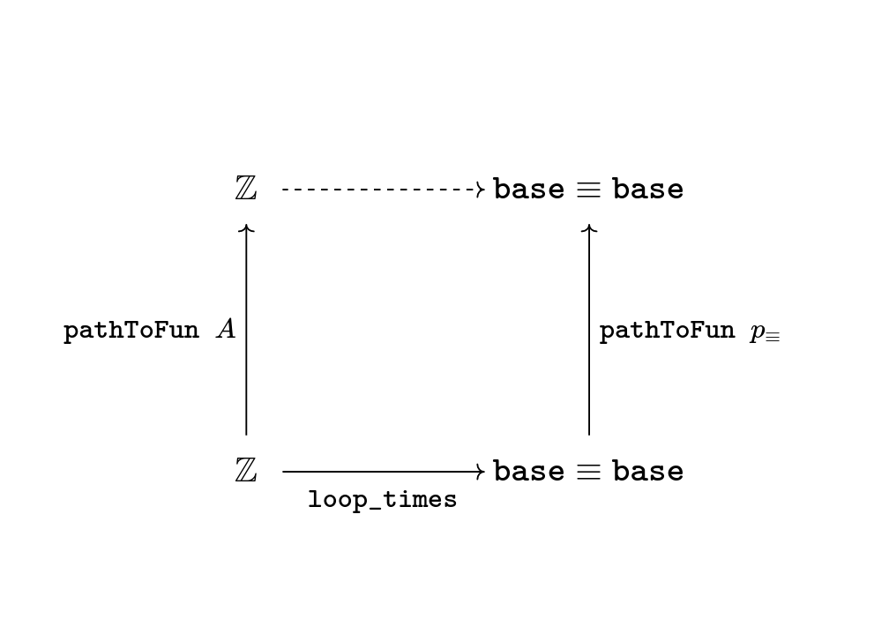

.. _quest3TheLoopSpaceIsZ:

*********************************
Quest 3 - The Loop Space is ``ℤ``
*********************************

In :ref:`quest1LoopSpaceOfTheCircle` we introduced our main
method of proving that the fundamental group
(which we take to be ``loopSpace S¹ base`` for now)
is ``ℤ``,
and in :ref:`quest2ZIsASet` we decided that this
means to show that they are equal spaces.

.. admonition:: The Goal

   .. code:: agda

      loopSpace≡ℤ : loopSpace S¹ base ≡ ℤ
      loopSpace≡Z = {!!}

As usual we will show this via giving an isomorphism,
so we must make comparison maps forward and back.
However, we discovered we had to define the backwards map
*over all of* ``S¹``.
We already have ``windingNumber``, the forwards comparison map,
which gives us a map ``loopSpace S¹ base → ℤ`` when applied to ``base``.

.. code:: agda

   windingNumber : (x : S¹) → base ≡ x → helix x

In this quest our goal is to make a map backwards

.. admonition:: Current Goal

   .. code:: agda

      rewind : (x : S¹) → helix x → base ≡ x

Since ``windingNumber`` took a path and found how
many times the path loops around, in general "an integer twisted around the helix a bit",
or "an integer plus a bit".
We want to make ``rewind`` do the reverse.
So ``rewind`` should take "an integer ``n`` plus a bit",
loop around ``n`` times, then add that extra corresponding bit,
the path from ``base`` to ``x`` to the end.

Part 0 - ``rewind``
===================

Dependent paths
---------------

We try making ``rewind``.
We can assume a point ``x : S¹``,
then case on what it is.

.. code:: agda

  rewind : (x : S¹) → helix x → base ≡ x
  rewind base = {!!}
  rewind (loop i) = {!!}

In the case of ``base`` we want a map
from ``helix base`` i.e. ``ℤ``, to ``base ≡ base``.
Try filling this in.

.. raw:: html

   

   

   
Solution

We want this to be the correct inverse,
described as looping around ``n`` times and adding that extra bit on the end.
However there is nothing to add at the end in this case,
so it should just be ``loop_times``,
which we already defined in :ref:`quest1LoopSpaceOfTheCircle`.

.. raw:: html

  

  

The case of ``loop i`` will be a lot more work.
Checking the goal we see that at each point ``loop i``
on the loop, it wants a point in the space
``helix (loop i) → base ≡ (loop i)``,
which it might reduce to ``sucℤPath i → base ≡ (loop i)``
according to the definition of ``helix``.

Collecting these spaces together along this ``i``,
we obtain a loop in the space of spaces based at the space ``ℤ → base ≡ base``
given by

.. code::

  λ i → helix (loop i) → base ≡ (loop i) : (ℤ → base ≡ base) ≡ (ℤ → base ≡ base).

Now collecting the points we need to give into a "path" as well,
we obtain the notion of a *dependent path* :
each point of this "path" belongs to a space along the path of spaces.
We define dependent paths and design a way of mapping out of
``S¹`` in general in :ref:`quest5DependentPaths` from :ref:`0-trinitarianism`.
We assume from now on knowledge of dependent paths.

Using ``outOfS¹``
-----------------

Now that we have a way of mapping out of ``S¹`` (using ``PathD``),
called ``outOfS¹D``,
try to use it to repackage the work we have to far.

.. raw:: html

  

  

  
Solution

Originally we have

.. code:: agda

  rewind : (x : S¹) → helix x → base ≡ x
  rewind base = loop_times
  rewind (loop i) = {!!}

Now we rearrange this to

.. code:: agda

  rewind : (x : S¹) → helix x → base ≡ x
  rewind = outOfS¹D (λ x → helix x → base ≡ x) loop_times {!!}

since our bundle over ``S¹`` is ``(λ x → helix x → base ≡ x)``
and our image for ``base`` is ``loop_times``.

.. raw:: html

  

  

Checking the last goal, it remains to give a dependent path of type
``PathD (λ i → sucℤPath i → base ≡ loop i) loop_times loop_times``.
Remembering the definition of ``PathD``,
this should be exactly giving a path
``pathToFun (λ i → sucℤPath i → base ≡ loop i) loop_times ≡ loop_times``,
since ``PathD`` reduces the issue of dependent paths to just paths in
the end space, which is ``ℤ → base ≡ base`` in this case.
Let's make this a chain of equalities :

.. raw:: html

  

  

  
Solution

.. code:: agda

  rewind : (x : S¹) → helix x → base ≡ x
  rewind = outOfS¹D (λ x → helix x → base ≡ x) loop_times
    (
      pathToFun (λ i → sucℤPath i → base ≡ loop i) loop_times
    ≡⟨ {!!} ⟩
      loop_times ∎
    )

.. raw:: html

  

  

Functions and ``pathToFun``
---------------------------

The map ``loop_times`` takes an integer and
does ``loop`` that many times.
On the other hand ``pathToFun`` follows how ``loop_times``
changed along the path of spaces ``λ i → sucℤPath i → base ≡ loop i``,
and spits out the corresponding point at the end.
This path of spaces is specifically a path of *function spaces*,
so we need to find a more explicit way of describing what ``pathToFun``
does to spaces of functions.

To generalize, suppose we have spaces ``A0 A1 B0 B1 : Type``
and paths ``A : A0 ≡ A1`` and ``B : B0 ≡ B1``.
Then let ``pAB`` denote the path
``λ i → A i → B i : (A0 → B0) ≡ (A1 → B1)``.
We want to figure out what ``pathToFun``
does when it follows a function ``f : A0 → B0`` along the path ``pAB``.

We know by functional extensionality that the function
``pathToFun pAB f : A1 → B1``
should be determined by what it does to terms in ``A1``,
so we can assume ``a1 : A1``.
The idea is we "apply ``f`` by sending ``a1`` back to ``A0``".
Since ``pathToFun (sym A) a1`` is meant to give the point in ``A0``
that "looks like ``a1``", we try applying ``f`` to this point,
then send it across again via the path ``B`` to the point
``f (pathToFun (sym A) a1)`` looks like in ``B1``.
We expect the outcome to be the same.

.. code:: agda

   pathToFun→ : {A0 A1 B0 B1 : Type} {A : A0 ≡ A1} {B : B0 ≡ B1} (f : A0 → B0) →
     pathToFun (λ i → A i → B i) f ≡ λ a1 → pathToFun B (f (pathToFun (sym A) a1))

.. image:: images/pathToFunAndPiTypes.png
  :width: 500
  :alt: pathToFunAndPiTypes
  :align: center

The proof of this in ``cubical agda`` is simply ``refl``,
so we need not even extract it as a lemma.

.. admonition:: A ``cubical`` hack

   Is actually one of the axioms asserted in ``cubical agda``
   that ``pathToFun (λ i → A i → B i) f`` is *externally equal to*
   ``λ a1 → pathToFun B (f (pathToFun (sym A) a1))``.
   Here we are using the ``cubical`` definition of ``pathToFun``
   so we can simply give ``refl`` for its proof.

   However, according the definition of ``pathToFun`` we gave
   in :ref:`Trinitarianism<pathToFun>`, they are not externally equal
   but can be shown to be internally equal using ``J``.
   We warn that in order to prove this using our definitions,

We interpret what this result means in our specific case :
We are making ``pathToFun (λ i → sucℤPath i → base ≡ loop i) loop_times``
into another map in the space ``ℤ → base ≡ base``,
by following along the diagram

Specifically, this map should take ``n : ℤ`` and first send it backwards along
``sucℤPath``, supposedly giving us ``n - 1``.
Then it applies ``loop_times``, obtaining the loop ``loop (n - 1) times``.
Lastly it follows ``loop (n - 1) times`` along the path ``λ i → base ≡ loop i``
(which itself is a loop starting and ending at ``base ≡ base`` in the space of spaces),
obtaining some path from ``base ≡ base``, which we expect to be internally
equal to ``loop n times``.

.. We can see how this sweeps out the appropriate maps along the way :

   .. image:: images/mapFun
     :width: 500
     :alt: description

Try putting this together in our definition of ``rewind``,
as a new intermediate step in our chain of equalities.

.. raw:: html

  

  

  
Solution

.. code:: agda

   rewind : (x : S¹) → helix x → base ≡ x
   rewind = outOfS¹D (λ x → helix x → base ≡ x) loop_times
     (
       pathToFun (λ i → sucℤPath i → base ≡ loop i) loop_times
     ≡⟨ refl ⟩
       (λ n → pathToFun (λ i → base ≡ loop i) (loop_times (pathToFun (sym sucℤPath) n)))
     ≡⟨ {!!} ⟩
       loop_times ∎
     )

.. raw:: html

  

  

We can simplify the above expression.
We know that ``pathToFun (sym sucℤPath) n`` should follow ``n``
along ``sucℤPath`` backwards, so it should be ``n - 1``.
We can use this to move a step closer to the goal.

.. raw:: html

  

  

  
Solution

This equality is *definitional*.

.. code:: agda

   rewind : (x : S¹) → helix x → base ≡ x
   rewind = outOfS¹D (λ x → helix x → base ≡ x) loop_times
     (
       pathToFun (λ i → sucℤPath i → base ≡ loop i) loop_times
     ≡⟨ refl ⟩
       (λ n → pathToFun (λ i → base ≡ loop i) (loop_times (pathToFun (sym sucℤPath) n)))
     ≡⟨ refl ⟩
       (λ n → pathToFun (λ i → base ≡ loop i) (loop (predℤ n) times))
     ≡⟨ {!!} ⟩
       loop_times ∎
     )

.. raw:: html

   

   

The path fibration and ``pathToFun``
------------------------------------

It remains to find out how ``pathToFun`` interacts with the path of loops coming out of base.
We call "the path of loops coming out of base" ``λ i → base ≡ loop i`` the *path fibration*
at ``base``.
The animation tells us that we are gradually concatenating the input ``loop (n - 1) times``
with ``loop``.
Hence we *should* obtain ``loop (n - 1) times ∙ loop``.
We are a bit lucky here, and these are in fact *definitionally equal*,
but to justify this in general, we can prove that
"following along the path fibration is the same as concatenating".

.. code:: agda

  pathToFunPathFibration : {A : Type} {x y z : A} (q : x ≡ y) (p : y ≡ z) →
    pathToFun (λ i → x ≡ p i) q ≡ q ∙ p

This is in fact a quick exercise.

.. raw:: html

  

  

  
Hint

We take the propositional perspective -
without loss of generality we can assume
``y`` and ``z`` are exactly the same.

Crucially : we know what ``pathToFun`` does to ``refl``
(recall ``pathToFunRefl`` from :ref:`the quest on paths<pathToFun>`).

.. raw:: html

  

  

.. raw:: html

  

  

  
Solution

.. code:: agda

   pathToFunPathFibration : {A : Type} {x y z : A} (q : x ≡ y) (p : y ≡ z) →
     pathToFun (λ i → x ≡ p i) q ≡ q ∙ p
   pathToFunPathFibration {A} {x} {y} q = J (λ z p → pathToFun (λ i → x ≡ p i) q ≡ q ∙ p)
     (
       pathToFun refl q
     ≡⟨ pathToFunRefl q ⟩
       q
     ≡⟨ ∙Refl q ⟩
       q ∙ refl ∎
     )

.. raw:: html

  

  

To include this in ``rewind`` we have

.. raw:: html

  

  

  
Spoiler

.. code:: agda

   rewind : (x : S¹) → helix x → base ≡ x
   rewind = outOfS¹D (λ x → helix x → base ≡ x) loop_times
     (
       pathToFun (λ i → sucℤPath i → base ≡ loop i) loop_times
     ≡⟨ refl ⟩ -- how pathToFun interacts with →
       (λ n → pathToFun (λ i → base ≡ loop i) (loop_times (pathToFun (sym sucℤPath) n)))
     ≡⟨ refl ⟩ -- sucℤPath is just taking successor, and so its inverse is definitionally taking predecessor
       (λ n → pathToFun (λ i → base ≡ loop i) (loop_times (predℤ n)))
     ≡⟨ funExt (λ n → pathToFunPathFibration _ _) ⟩ -- how pathToFun interacts with the "path fibration"
       (λ n → (loop (predℤ n) times) ∙ loop)
     ≡⟨ {!!} ⟩
       loop_times ∎
     )

.. raw:: html

  

  

There are several ways to complete this final part.
We will leave the rest in a hint.

.. raw:: html

  

  

  
Hint

Applying functional extensionality we just need to show that for each ``n : ℤ``
the outputs are equal, i.e. ``loop predℤ n times ∙ loop ≡ loop n times``.
By our design of ``loop_times`` we should have that
``loop m times ∙ loop`` is equal to ``loop (m + 1) times``.
Then we are reduced to showing that ``loop (sucℤ predℤ n) times ≡ loop n times``,
or just ``sucℤ predℤ n ≡ n``.

.. raw:: html

  

  

.. raw:: html

  

  

  
Solution

.. code:: agda

   rewind : (x : S¹) → helix x → base ≡ x
   rewind = outOfS¹D (λ x → helix x → base ≡ x) loop_times
     (
       pathToFun (λ i → sucℤPath i → base ≡ loop i) loop_times
     ≡⟨ refl ⟩ -- how pathToFun interacts with →
       (λ n → pathToFun (λ i → base ≡ loop i) (loop_times (pathToFun (sym sucℤPath) n)))
     ≡⟨ refl ⟩ -- sucℤPath is just taking successor, and so its inverse is definitionally taking predecessor
       (λ n → pathToFun (λ i → base ≡ loop i) (loop_times (predℤ n)))
     ≡⟨ funExt (λ n → pathToFunPathFibration _ _) ⟩ -- how pathToFun interacts with the "path fibration"
       (λ n → (loop (predℤ n) times) ∙ loop)
     ≡⟨ funExt (λ n →
          loop predℤ n times ∙ loop
         ≡⟨ loopSucℤtimes (predℤ n) ⟩
           loop (sucℤ (predℤ n)) times
         ≡⟨ cong loop_times (sucℤPredℤ n) ⟩
           loop n times ∎) ⟩
       loop_times ∎
     )

.. raw:: html

  

  

We can check that ``rewind base`` is indeed ``loop_times``
by using ``C-c C-n``.
This is to be expected as ``outOfS¹`` evaluated at ``base``
should back exactly what we fed it,
as mentioned in the :ref:`discussion on mapping out of the circle <mappingOutOfTheCirlce>`.

Part 1 - ``rewind`` is a right inverse
======================================

We are now in a position to approach the main goal :

.. code:: agda

   loopSpaceS¹≡ℤ : loopSpace S¹ base ≡ ℤ
   loopSpaceS¹≡ℤ = {!!}

We have reduced this to giving an isomorphism,
which involves giving the map ``windingNumber base`` forward
and ``loop_times`` backwards,
and showing that they are inverses of each other.

Hence the next step is to show that
"looping ``n`` times then taking the winding number gives back ``n``".
Try to state and prove this in ``1FundamentalGroup/Quest3.agda``.
In the hints we will use intuitive notation for integers
that may not align exactly with ``agda`` code.

.. The statement

.. raw:: html

  

  

  
The statement

.. code:: agda

   windingNumberRewindBase : (n : ℤ) → windingNumber base (rewind base n) ≡ n
   windingNumberRewindBase = {!!}

We identify ``rewind base`` with ``loop_times``,
since they are externally equal.

.. raw:: html

  

  

.. Hint 0

.. raw:: html

  

  

  
Hint 0

Since ``loop_times`` was defined by casing on ``n`` we case on ``n`` -
it could be zero, a positive integer, negative one, or less than negative one.

.. raw:: html

  

  

.. Hint 1

.. raw:: html

  

  

  
Hint 1

Some of the cases are trivial -
we know exactly what ``loop 0 times``
and ``windingNumber base loop`` are.

.. raw:: html

  

  

  
Solution for Hint 1

.. code:: agda

   windingNumberRewindBase : (n : ℤ) → windingNumber base (rewind base n) ≡ n
   windingNumberRewindBase (pos zero) = refl
   windingNumberRewindBase (pos (suc n)) = {!!}
   windingNumberRewindBase (negsuc zero) = refl
   windingNumberRewindBase (negsuc (suc n)) = {!!}

.. raw:: html

  

  

.. raw:: html

  

  

.. Hint 2

.. raw:: html

  

  

  
Hint 2

We can identify ``windingNumber base`` with its definition,
reducing the problem to showing that
``endPt helix (loop n times) 0`` is equal to ``n``,
in the seperate cases.

For the first case,
we can reduce ``loop (n + 1) times`` to just ``loop n times ∙ loop``
since that was the definition.
Hence we are interested in what ``endPt helix (loop n times ∙ loop) 0`` is.
Recalling our intuition behind ``endPt``,
this amounts to following the point ``0`` up the ``helix`` along the path
``loop n times ∙ loop``.
This should just be going to ``endPt helix (loop n times) 0`` then adding ``1``.

You can also check what ``agda`` reduces the expression to by writing it in the hole and
then doing ``C-c C-n``.
It should look something like ``sucℤ (transp (λ i → helix (loop pos n times i)) i0 (pos 0))``.
Clearly it has reduced the definition a bit too far,
but the important idea is there, that it is ``+ 1`` of whatever data we have already.

Lastly we can just take ``sucℤ`` on both sides of an equality we have from the induction hypothesis.

.. raw:: html

  

  

.. Solution

.. raw:: html

  

  

  
Solution

For one of the cases we detail the
thought process going on above,
and for the last case we extract only the important part of the proof.

.. code:: agda

   windingNumberRewindBase : (n : ℤ) → windingNumber base (rewind base n) ≡ n
   windingNumberRewindBase (pos zero) = refl
   windingNumberRewindBase (pos (suc n)) =
       windingNumber base (rewind base (pos (suc n)))
     ≡⟨ refl ⟩
       windingNumber base (loop (pos n) times ∙ loop)
     ≡⟨ refl ⟩
       endPt helix (loop (pos n) times ∙ loop) (pos zero)
     ≡⟨ refl ⟩
       sucℤ (endPt helix (loop (pos n) times) (pos zero))
     ≡⟨ cong sucℤ (windingNumberRewindBase (pos n)) ⟩
       sucℤ (pos n)
     ≡⟨ refl ⟩
       pos (suc n) ∎
   windingNumberRewindBase (negsuc zero) = refl
   windingNumberRewindBase (negsuc (suc n)) = cong predℤ (windingNumberRewindBase (negsuc n))

.. raw:: html

  

  

You might wonder if it is possible to make the above map work across all of ``S¹``,
and the answer is yes.
This is not really necessary for our goal,
so feel free to skip to the next part if you are not interested.
Try stating and proving the generalization of the above;
which we call ``windingNumberRewind``.

.. statement

.. raw:: html

  

  

  
The Statement

.. code:: agda

   windingNumberRewind : (x : S¹) (n : helix x) → windingNumber x (rewind x n) ≡ n
   windingNumberRewind = {!!}

.. raw:: html

  

  

.. Hint

.. raw:: html

  

  

  
Hint 0

We defined ``rewind`` by casing on points in the circle
and ``rewind`` is the first function being applied,
so it would make sense to case on points in the circle.
In the case when the point is ``base`` we can just give
the map we wanted to generalize in the first place.

.. raw:: html

  

  

  
Solution to Hint 0

.. code:: agda

   windingNumberRewind : (x : S¹) (n : helix x) → windingNumber x (rewind x n) ≡ n
   windingNumberRewind =
     outOfS¹D (λ x → (n : helix x) → windingNumber x (rewind x n) ≡ n)
       windingNumberRewindBase {!!}

.. raw:: html

  

  

.. raw:: html

  

  

.. Hint 1

.. raw:: html

  

  

  
Hint 1

Checking the last hole we see that we need to give a dependent path from
``windingNumberRewindBase`` to itself.
According to the definition of a dependent path,
this is just a path in the last fiber from ``pathToFun`` of ``windingNumberRewindBase``
to ``windingNumberRewindBase``
(the fiber is ``(n : ℤ) → windingNumber base (rewind base n) ≡ n``).
Now this might seem very complicated :
even after applying functional extensionality (this is equality of two functions)
this would be "finding a path between paths in ``ℤ``".
Try repeating that last bit in your head a couple of times.

.. raw:: html

  

  

.. Hint 2

.. raw:: html

  

  

  
Hint 2

We put a lot of effort into showing that ``ℤ`` is a set.

.. raw:: html

  

  

.. Solution

.. raw:: html

  

  

  
Solution

.. code:: agda

   windingNumberRewind : (x : S¹) (n : helix x) → windingNumber x (rewind x n) ≡ n
   windingNumberRewind = -- must case on x / use recursor / outOfS¹ since that is def of rewind
     outOfS¹D (λ x → (n : helix x) → windingNumber x (rewind x n) ≡ n)
       windingNumberRewindBase (
         pathToFun
           (λ i → (n : helix (loop i)) → windingNumber (loop i) (rewind (loop i) n) ≡ n)
           windingNumberRewindBase
       ≡⟨ funExt (λ x → isSetℤ _ _ _ _ ) ⟩
         windingNumberRewindBase ∎)

.. raw:: html

  

  

Part 2 - ``rewind`` is a left inverse
=====================================

Try to show that ``rewind`` is a left inverse.

.. The statement

.. raw:: html

  

  

  
The Statement

Just like we struggled to only define ``windingNumber base``
without access to the entire circle,
we make sure to include all the data we have access to.
Note that this was not the case before.

.. code:: agda

   rewindWindingNumber : (x : S¹) (p : base ≡ x) → rewind x (windingNumber x p) ≡ p
   rewindWindingNumber x = {!!}

.. raw:: html

  

  

.. Hint 0

.. raw:: html

  

  

  
Hint 0

Remembering that ``windingNumber x p`` is externally equal to ``endPt helix p 0``,
and that ``endPt`` is defined by path induction - using ``J``
(this is not exactly true for ``endPt`` from the library for ``cubical`` reasons),
the obvious thing to do here is to do path induction.

.. raw:: html

  

  

  
Solution for Hint 0

.. code:: agda

   rewindWindingNumber : (x : S¹) (p : base ≡ x) → rewind x (windingNumber x p) ≡ p
   rewindWindingNumber x = J (λ x p → rewind x (windingNumber x p) ≡ p) {!!}

.. raw:: html

  

  

.. raw:: html

  

  

.. Hint 1

.. raw:: html

  

  

  
Hint 1

It suffices to show that ``rewind x (windingNumber x refl) ≡ refl``,
which by reducing the left side is the same as showing
``loop_times (endPt helix refl 0) ≡ refl``.

.. raw:: html

  

  

  
Solution to Hint 1

.. code:: agda

   rewindWindingNumber : (x : S¹) (p : base ≡ x) → rewind x (windingNumber x p) ≡ p
   rewindWindingNumber x = J (λ x p → rewind x (windingNumber x p) ≡ p)
        (rewind base (windingNumber base refl)
      ≡⟨ refl ⟩
        loop_times (endPt helix (refl {x = base}) (pos zero))
      ≡⟨ {!!} ⟩
        refl ∎)

.. raw:: html

  

  

.. raw:: html

  

  

.. Hint 2

.. raw:: html

  

  

  
Hint 2

We know what ``endPt`` does to ``refl``, which is given by the result ``endPtRefl``.
If you need to recall what ``endPtRefl`` proves you can type it into the hole
and do ``C-c C-.`` for the goal and the type of ``endPtRefl``.

.. raw:: html

  

  

  
Solution to Hint 2

.. code:: agda

   rewindWindingNumber : (x : S¹) (p : base ≡ x) → rewind x (windingNumber x p) ≡ p
   rewindWindingNumber x = J (λ x p → rewind x (windingNumber x p) ≡ p)
        (rewind base (windingNumber base refl)
      ≡⟨ refl ⟩
        loop_times (endPt helix (refl {x = base}) (pos zero))
      ≡⟨ cong loop_times (cong (λ g → g (pos zero)) (endPtRefl {x = base} helix)) ⟩
        loop (pos zero) times
      ≡⟨ {!!} ⟩
        refl ∎)

.. raw:: html

  

  

.. raw:: html

  

  

.. raw:: html

  

  

  
Solution

The last step is simply remembering how ``loop_times`` computes.

.. code:: agda

  rewindWindingNumber : (x : S¹) (p : base ≡ x) → rewind x (windingNumber x p) ≡ p
  rewindWindingNumber x = J (λ x p → rewind x (windingNumber x p) ≡ p)
       (rewind base (windingNumber base refl)
     ≡⟨ refl ⟩
       loop_times (endPt helix (refl {x = base}) (pos zero)) -- reduce both definitions
     ≡⟨ cong loop_times (cong (λ g → g (pos zero)) (endPtRefl {x = base} helix)) ⟩
       loop (pos zero) times
     ≡⟨ refl ⟩
       refl ∎)

.. raw:: html

  

  

Part 3 - The Loop Space is ``ℤ``
================================

We can conclude our main goal now, by collecting all of the components we have made above.
We leave you the pleasure.

.. raw:: html

  

  

  
Solution

As usual we construct an isomorphism,
but we can choose to do this over the entire circle
or just between ``loopSpace S¹ base`` and ``ℤ``.
We do the former and have the latter as a corollary,
but you could just do the latter directly as well.

.. code:: agda

   pathFibration≡helix : (x : S¹) → (base ≡ x) ≡ helix x
   pathFibration≡helix x =
     isoToPath (iso (windingNumber x) (rewind x) (windingNumberRewind x) (rewindWindingNumber x))

   loopSpaceS¹≡ℤ : loopSpace S¹ base ≡ ℤ
   loopSpaceS¹≡ℤ = pathFibration≡helix base

.. raw:: html

  

  

What now?
---------

We have mentioned already that we aren't *exactly* working with the fundamental group,
but the loop space.
In the final quest of this arc we discuss the definition of the fundamental group and
show that the loop space in this case is the fundamental group already.
