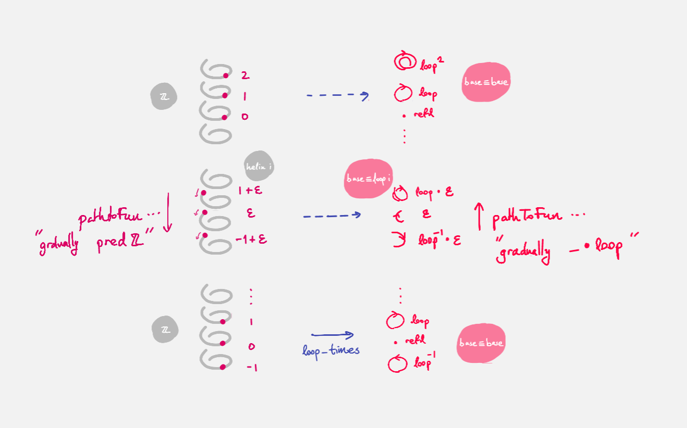

.. _quest3TheMissingComparisonMap:

************************************
Quest 3 - The Missing Comparison Map
************************************

In :ref:`quest1LoopSpaceOfTheCircle` we introduced our main
method of proving that the fundamental group
(which we take to be ``loopSpace S¹ base`` for now)
is ``ℤ``,
and in :ref:`quest2ZIsASet` we decided that this
means to show that they are equal spaces.

.. admonition:: The Goal

   .. code:: agda

      loopSpace≡ℤ : loopSpace S¹ base ≡ ℤ
      loopSpace≡Z = {!!}

As usual we will show this via giving an isomorphism,
so we must make comparison maps forward and back.
However, we discovered we had to define the backwards map
*over all of* ``S¹``.
We already have ``windingNumber``, the forwards comparison map,
which gives us a map ``loopSpace S¹ base → ℤ`` when applied to ``base``.

.. code:: agda

   windingNumber : (x : S¹) → base ≡ x → helix x

   windingNumber base : loopSpace S¹ base → ℤ

In this quest our goal is to make a map backwards

.. admonition:: Current Goal

   .. code:: agda

      rewind : (x : S¹) → helix x → base ≡ x

Since ``windingNumber`` took a path and found how
many times the path loops around, in general "an integer twisted around the helix a bit",
or "an integer plus a bit".
We want to make ``rewind`` do the reverse.
So ``rewind`` should take "an integer ``n`` plus a bit",
loop around ``n`` times, then add that extra corresponding bit,
the path from ``base`` to ``x`` to the end.

Part 0 - Dependent Paths
========================

We first try making ``rewind`` directly.
If we assume a point ``x : S¹``,
then we can case on what it is.

.. code:: agda

  rewind : (x : S¹) → helix x → base ≡ x
  rewind base = {!!}
  rewind (loop i) = {!!}

..
   If you follow along in ``1FundamentalGroup/Quest3.agda``
   you will need to do some imports :

   .. admonition:: Importing files

      Unlike in the previous quests, we have *not* imported anything for you.
      If you write the above definition and try to
      load the file ``agda`` should be complaining that it doesn't know what
      ``S¹`` is.

      .. code::

         Not in scope:
           S¹
           at ...
         when scope checking S¹

      You can import ``S¹ ; base ; loop`` from the file ``Cubical.HITs.S1`` in the ``cubical library``,
      by writing

      .. code:: agda

         open import Cubical.HITs.S1 using ( S¹ ; base ; loop )

      at the top of the file (after the ``where``).
      ``Cubical.HITs.S1` is where ``S¹`` was defined in the cubical library
      (this directory is relative to wherever the cubical library ``.agda-lib``
      file is on your computer).
      This will *only* import those three things from that file,
      and is a good idea since we might have overlapping definitions
      (such as ``helix``).

      If you load again it should be complaining about ``helix``,
      which was defined in ``1FundamentalGroup.Quest1``.
      So in a new line add

      .. code:: agda

         open import 1FundamentalGroup.Quest1

      Which should import *everything* from your ``Quest1`` file.
      Load the file to check this works.
      This time it has found the file relative to the HoTT Game library
      ``TheHoTTGame.agda-lib``.

      The file containing the definition of the path space is ``Cubical.Foundations.Prelude``.

In the case of ``base`` we want a map
from ``helix base`` i.e. ``ℤ``, to ``base ≡ base``.
Try filling this in.

.. raw:: html

   

   

   
Solution

We want this to be the correct inverse,
described as looping around ``n`` times and adding that extra bit on the end.
However there is nothing to add at the end in this case,
so it should just be ``loop_times``,
which we already defined in :ref:`quest1LoopSpaceOfTheCircle`.

.. raw:: html

  

  

The case of ``loop i`` will be a lot more work.
Checking the goal we see that at each point ``loop i``
on the loop, it wants a point in the space
``helix (loop i) → base ≡ (loop i)``,
which it might reduce to ``sucℤPath i → base ≡ (loop i)``
according to the definition of ``helix``.

Collecting these spaces together along this ``i``,
we obtain a loop in the space of spaces based at the space ``ℤ → base ≡ base``
given by

.. code::

  λ i → helix (loop i) → base ≡ (loop i) : (ℤ → base ≡ base) ≡ (ℤ → base ≡ base).

Now collecting the points we need to give into a "path" as well,
we obtain the notion of a *dependent path* :
each point of this "path" belongs to a space along the path of spaces.
We define dependent paths and design a way of mapping out of
``S¹`` in general in :ref:`quest5DependentPaths` from :ref:`0-trinitarianism`.
We assume from now on knowledge of dependent paths.

Using ``outOfS¹``
-----------------

Now that we have a way of mapping out of ``S¹`` (using ``PathD``),
called ``outOfS¹D``,
try to use it to repackage the work we have to far.

.. raw:: html

  

  

  
Solution

Originally we have

.. code:: agda

  rewind : (x : S¹) → helix x → base ≡ x
  rewind base = loop_times
  rewind (loop i) = {!!}

Now we rearrange this to

.. code:: agda

  rewind : (x : S¹) → helix x → base ≡ x
  rewind = outOfS¹D (λ x → helix x → base ≡ x) loop_times {!!}

since our bundle over ``S¹`` is ``(λ x → helix x → base ≡ x)``
and our image for ``base`` is ``loop_times``.

.. raw:: html

  

  

Checking the last goal, it remains to give a dependent path of type
``PathD (λ i → sucℤPath i → base ≡ loop i) loop_times loop_times``.
Remembering the definition of ``PathD``,
this should be exactly giving a path
``pathToFun (λ i → sucℤPath i → base ≡ loop i) loop_times ≡ loop_times``,
since ``PathD`` reduces the issue of dependent paths to just paths in
the end space, which is ``ℤ → base ≡ base`` in this case.
Let's make this a chain of equalities :

.. raw:: html

  

  

  
Solution

.. code:: agda

  rewind : (x : S¹) → helix x → base ≡ x
  rewind = outOfS¹D (λ x → helix x → base ≡ x) loop_times
    (
      pathToFun (λ i → sucℤPath i → base ≡ loop i) loop_times
    ≡⟨ {!!} ⟩
      loop_times ∎
    )

.. raw:: html

  

  

Let us remind ourselves that this means,
taking advantage of the propositional perspective.
The map ``loop_times`` takes an integer and
does ``loop`` that many times.
On the other hand ``pathToFun`` follows how ``loop_times``
changed along the path of spaces ``λ i → sucℤPath i → base ≡ loop i``,
and spits out the corresponding point at the end.
This path of spaces is specifically a path of *function spaces*,
so we need to find a more explicit way of describing what ``pathToFun``
does to spaces of functions.

Functions and ``pathToFun``
---------------------------

To generalize, suppose we have spaces ``A0 A1 B0 B1 : Type``
and paths ``A : A0 ≡ A1`` and ``B : B0 ≡ B1``.
Then let ``pAB`` denote the path
``λ i → A i → B i : (A0 → B0) ≡ (A1 → B1)``.
We want to figure out what ``pathToFun``
does when it follows a function ``f : A0 → B0`` along the path ``pAB``.

We know by functional extensionality that the function
``pathToFun pAB f : A1 → B1``
should be determined by what it does to terms in ``A1``,
so we can assume ``a1 : A1``.
The idea is we "apply ``f`` by sending ``a1`` back to ``A0``".
Since ``pathToFun (sym A) a1`` is meant to give the point in ``A0``
that "looks like ``a1``", we try applying ``f`` to this point,
then send it across again via the path ``B`` to the point
``f (pathToFun (sym A) a1)`` looks like in ``B1``.
We expect the outcome to be the same.

.. code:: agda

   pathToFun→ : {A0 A1 B0 B1 : Type} {A : A0 ≡ A1} {B : B0 ≡ B1} (f : A0 → B0) →
     pathToFun (λ i → A i → B i) f ≡ λ a1 → pathToFun B (f (pathToFun (sym A) a1))

.. missing picture of commutative diagram

Here we simply use the result without proof.

.. We prove it *somewhere*??
.. missing link

We interpret what this result means in our specific case :
We are making ``pathToFun (λ i → sucℤPath i → base ≡ loop i) loop_times``
into another map in the space ``ℤ → base ≡ base``,
by following along the diagram

.. missing picture of commutative diagram

Specifically, this map should take an ``n : ℤ`` and first send it backwards along
``sucℤPath`` (``A``), supposedly giving us ``n - 1``.
Then it applies ``loop_times``, obtaining the loop ``loop (n - 1) times``.
Lastly it this loop follows along the path ``λ i → base ≡ loop i``
(which itself is a loop starting and ending at ``base ≡ base`` in the space of spaces),
obtaining some path from ``base ≡ base``, which we expect to be internally
equal to ``loop n times``.
We can see how this sweeps out the appropriate maps along the way :

Try putting this together in our definition of ``rewind``,
as a new intermediate step in our chain of equalities.

.. raw:: html

  

  

  
Solution

.. code:: agda

   rewind : (x : S¹) → helix x → base ≡ x
   rewind = outOfS¹D (λ x → helix x → base ≡ x) loop_times
     (
       pathToFun (λ i → sucℤPath i → base ≡ loop i) loop_times
     ≡⟨ pathToFun→ sucℤPath (λ i → base ≡ loop i) loop_times ⟩
       (λ n → pathToFun (λ i → base ≡ loop i) (loop_times (pathToFun (sym sucℤPath) n)))
     ≡⟨ {!!} ⟩
       loop_times ∎
     )

.. raw:: html

  

  

We can simplify the above expression.
We know that ``pathToFun (sym sucℤPath) n`` should follow ``n``
along ``sucℤPath`` backwards,
so it should be ``n - 1``.
Try to formalize this.

.. raw:: html

  

  

  
Solution

This equality is *definitional*.

.. code:: agda

   rewind : (x : S¹) → helix x → base ≡ x
   rewind = outOfS¹D (λ x → helix x → base ≡ x) loop_times
     (
       pathToFun (λ i → sucℤPath i → base ≡ loop i) loop_times
     ≡⟨ pathToFun→ sucℤPath (λ i → base ≡ loop i) loop_times ⟩
       (λ n → pathToFun (λ i → base ≡ loop i) (loop_times (pathToFun (sym sucℤPath) n)))
     ≡⟨ refl ⟩
       (λ n → pathToFun (λ i → base ≡ loop i) (loop (predℤ n) times))
     ≡⟨ {!!} ⟩
       loop_times ∎
     )

.. raw:: html

   

   

The path fibration
------------------

It remains to find out how ``pathToFun`` interacts with the path of loops coming out of base.
We call "the path of loops coming out of base" ``λ i → base ≡ loop i`` the path fibration
at ``base``.
The picture tells us that we are gradually concatenating the input ``loop (n - 1) times``
with ``loop``.
Hence we should obtain ``loop (n - 1) times ∙ loop``.
We are a bit lucky here, and these are in fact *definitionally equal*,
but to justify this in general, we can prove that
"following along the path fibration is the same as concatenating".

.. code:: agda

  pathToFunPathFibration : {A : Type} {x y z : A} (q : x ≡ y) (p : y ≡ z) →
    pathToFun (λ i → x ≡ p i) q ≡ q ∙ p

This is in fact a quick exercise.

.. raw:: html

  

  

  
Hint

We take the propositional perspective -
without loss of generality we can assume
``y`` and ``z`` are exactly the same.

Crucially : we know what ``pathToFun`` does to ``refl``
(recall ``pathToFunRefl`` from :ref:`the quest on paths<pathToFun>`).

.. raw:: html

  

  

.. raw:: html

  

  

  
Solution

.. code:: agda

   pathToFunPathFibration : {A : Type} {x y z : A} (q : x ≡ y) (p : y ≡ z) →
     pathToFun (λ i → x ≡ p i) q ≡ q ∙ p
   pathToFunPathFibration {A} {x} {y} q = J (λ z p → pathToFun (λ i → x ≡ p i) q ≡ q ∙ p)
     (
       pathToFun refl q
     ≡⟨ pathToFunRefl q ⟩
       q
     ≡⟨ ∙Refl q ⟩
       q ∙ refl ∎
     )

.. raw:: html

  

  

To include this in ``rewind`` we have

.. raw:: html

  

  

  
Spoiler

.. code:: agda

   rewind : (x : S¹) → helix x → base ≡ x
   rewind = outOfS¹D (λ x → helix x → base ≡ x) loop_times
     (
       pathToFun (λ i → sucℤPath i → base ≡ loop i) loop_times
     ≡⟨ pathToFun→ sucℤPath (λ i → base ≡ loop i) loop_times ⟩ -- how pathToFun interacts with →
       (λ n → pathToFun (λ i → base ≡ loop i) (loop_times (pathToFun (sym sucℤPath) n)))
     ≡⟨ refl ⟩ -- sucℤPath is just taking successor, and so its inverse is definitionally taking predecessor
       (λ n → pathToFun (λ i → base ≡ loop i) (loop_times (predℤ n)))
     ≡⟨ funExt (λ n → pathToFunPathFibration _ _) ⟩ -- how pathToFun interacts with the "path fibration"
       (λ n → (loop (predℤ n) times) ∙ loop)
     ≡⟨ {!!} ⟩
       loop_times ∎
     )

.. raw:: html

  

  

There are several ways to complete this final part.
We will leave the rest in a hint.

.. raw:: html

  

  

  
Hint

Applying functional extensionality we just need to show that for each ``n : ℤ``
the outputs are equal, i.e. ``loop predℤ n times ∙ loop ≡ loop n times``.
By our design of ``loop_times`` we should have that
``loop m times ∙ loop`` is equal to ``loop (m + 1) times``.
Then we are reduced to showing that ``loop (sucℤ predℤ n) times ≡ loop n times``,
or just ``sucℤ predℤ n ≡ n``.

.. raw:: html

  

  

.. raw:: html

  

  

  
Solution

.. code:: agda

   rewind : (x : S¹) → helix x → base ≡ x
   rewind = outOfS¹D (λ x → helix x → base ≡ x) loop_times
     (
       pathToFun (λ i → sucℤPath i → base ≡ loop i) loop_times
     ≡⟨ pathToFun→ sucℤPath (λ i → base ≡ loop i) loop_times ⟩ -- how pathToFun interacts with →
       (λ n → pathToFun (λ i → base ≡ loop i) (loop_times (pathToFun (sym sucℤPath) n)))
     ≡⟨ refl ⟩ -- sucℤPath is just taking successor, and so its inverse is definitionally taking predecessor
       (λ n → pathToFun (λ i → base ≡ loop i) (loop_times (predℤ n)))
     ≡⟨ funExt (λ n → pathToFunPathFibration _ _) ⟩ -- how pathToFun interacts with the "path fibration"
       (λ n → (loop (predℤ n) times) ∙ loop)
     ≡⟨ funExt (λ n →
          loop predℤ n times ∙ loop
         ≡⟨ loopSucℤtimes (predℤ n) ⟩
           loop (sucℤ (predℤ n)) times
         ≡⟨ cong loop_times (sucℤPredℤ n) ⟩
           loop n times ∎) ⟩
       loop_times ∎
     )

.. raw:: html

  

  

