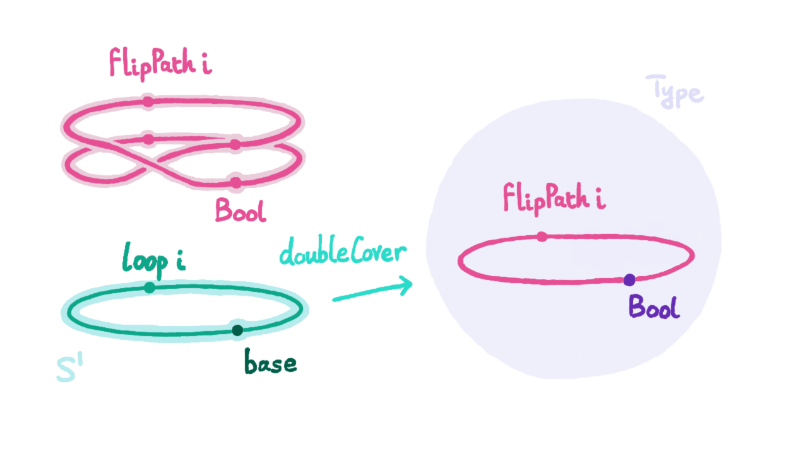

*************
The HoTT Game
*************

The Homotopy Type Theory (HoTT) Game is a project written by mathematicians
for mathematicians interested in HoTT and no experience in proof verification,
with the aim of introducing
`cubical agda <https://agda.readthedocs.io/en/v2.6.0/language/cubical.html>`_
as a tool for trying out mathematics in HoTT.

To get started with the HoTT Game, go to 
`Getting Started <https://thehottgameguide.readthedocs.io/en/latest/getting-started/index.html>`_.

This game was created by
`Joseph Hua <https://jlh18.github.io/>`_, 
`Ken Lee <http://kl-i.github.io/>`_,
and `Bendit Chan <https://benditchan.wordpress.com/>`_.

.. toctree::
   :maxdepth: 2

   getting-started/index
   0-trinitarianism/index
   1-fundamental-group/index
  
